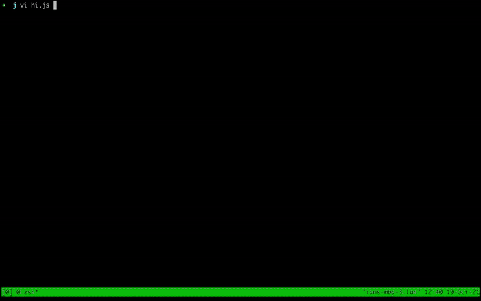

# nanos

[](https://circleci.com/gh/nanovms/nanos)

<p align="center">
  
</p>

Nanos is a new kernel designed to run one and only one application in a
virtualized environment. It has several constraints on it compared to a
general purpose operating system such as Windows or Linux - namely it's
a single process system with no support for running multiple programs
nor does it have the concept of users or remote administration via ssh.

Read more about the Nanos Charter [here](CHARTER.md).

1. [Getting Started](#getting-started)
2. [Documentation](#documentation)
3. [Support](#support)

### Getting Started

Please use the [ops](https://ops.city) build tool to run your applications with Nanos unless you plan on hacking on Nanos itself.
Many ready-to-use examples for running applications on Nanos using ops are available [here](https://github.com/nanovms/ops-examples).

#### Quick Start

Install ops && nanos:

```
curl https://ops.city/get.sh -sSfL | sh
```



### Building/Running

It is highly encouraged to use [ops](https://github.com/nanovms/ops) to build and run your applications using Nanos unless you are planning
on modifying Nanos. [ops](https://ops.city) provides sensible defaults for most users and
incorporates our understanding of how to appropriately best use Nanos.
It is also currently highly coupled to Nanos.

If you are running in a vm already (which is a bad idea) you'll need to specify
that you don't want hardware acceleration. For instance you can run
Nanos in virtualbox on a mac but it will be slow and hard to configure.

You can build and run on mac and linux. Nanos supports KVM on linux and
HVF on osx currently for acceleration. [ops](https://ops.city) has facilities to deploy to public clouds (AWS, GCE, Azure, and many others).

#### Building From Source on a Mac

Note: This is only recommended for those that wish to make code changes
to Nanos itself.

Install Homebrew:
```
/usr/bin/ruby -e "$(curl -fsSL https://raw.githubusercontent.com/Homebrew/install/master/install)"
```

Grab Dependencies:

This installs the correct toolchain and will install an up-to-date qemu.
It is highly recommended to be running the latest qemu otherwise you
might run into issues.

For Intel-based Macs:
```
brew update && brew install nasm go wget ent
brew tap nanovms/homebrew-toolchains
brew install x86_64-elf-binutils
brew tap nanovms/homebrew-qemu
brew install nanovms/homebrew-qemu/qemu
```
(note: ```go``` is only needed for certain [examples](#examples), but not for building the kernel)

For ARM-based Macs (M1/M2):

```
brew update && brew install go wget ent qemu aarch64-elf-binutils
```
##### To build and link runtime tests or aarch64 linux user programs:
```
brew tap nanovms/homebrew-toolchains
brew install aarch64-linux-binutils
```

Create a Chroot:
(this isn't absolutely necessary)

For Intel-based Macs:

```
mkdir target-root && cd target-root && wget
https://storage.googleapis.com/testmisc/target-root.tar.gz && tar xzf target-root.tar.gz
```

For ARM-based Macs (M1/M2):

```
mkdir target-root && cd target-root && wget
https://storage.googleapis.com/testmisc/arm64-target-root-new.tar.gz && tar xzf arm64-target-root-new.tar.gz
```

You should also set the environment variable NANOS_TARGET_ROOT to the path of 
target-root created above in order to create the example and test images.

#### Building From Source on Linux

Note: This is only recommended for those that wish to make code changes to Nanos itself.

Nanos doesn't need too many dependencies on Linux.

To build you need to install nasm, qemu and go:

```
sudo apt-get install qemu-system-x86 nasm golang-go
```
(note: ```go``` is only needed for certain [examples](#examples), but not for building the kernel)

For tests you'll also need the following installed:

```
sudo apt-get install ent ruby
```

Ops:
```
curl https://ops.city/get.sh -sSfL | sh
```

Rust:
```
curl --proto '=https' --tlsv1.2 -sSf https://sh.rustup.rs | sh
```

If you wish to use FUSE you'll also want to install

```
sudo apt-get install libfuse-dev fuse
```

#### To build the kernel (in addition to the bootloaders and klibs):
```
make kernel
```

#### Examples


To run an example program from the test/runtime folder:

With hardware acceleration:

```
make run
```
Without hardware acceleration:

```
make run-noaccel
```

Set ```TARGET``` to run a specific example:
```
make TARGET=<example> run
```

Check out [test/runtime](test/runtime/README.md) for a list of examples. Certain examples require ```go``` to be built. 

More examples can be found in [docs/examples#examples](https://docs.ops.city/ops/examples#examples).

### Documentation

You can find more documentation on the ops [docs site](https://nanovms.gitbook.io/ops/)

### Benchmarks

In an effort for transparency and to collect, categorize, and document
benchmarks we will start listing them here. The aims should be to be as
reproducible and contain as much information as possible:

[Go on GCloud](https://github.com/nanovms/nanos/wiki/go_gcloud): 18k req/sec

[Rust on GCloud](https://github.com/nanovms/nanos/wiki/rust_gcloud): 22k req/sec

[Node.JS on AWS](https://github.com/nanovms/nanos/wiki/nodejs_aws): 2k req/sec

[Node.JS on GCloud](https://github.com/nanovms/nanos/wiki/nodejs_gcloud): 4k req/sec

### Tests

To run tests:
```
make test-noaccel
```

### Development Running Instructions

For Nanos try running the first example first:
```
make run
```

To try a different target currently found in test/runtime/ you can:

1) cp the manifest file to target.manifest
2) add your code and set a target in test/runtime/Makefile

```
make TARGET=mynewtarget run
```

You may also wish to use [ops](https://github.com/nanovms/ops) to
develop locally. If that's the case a commonly used idiom is to simply
copy the 3 required files to an appropriate release:

```
cp output/tools/bin/mkfs ~/.ops/0.1.47/.
cp output/platform/pc/boot/boot.img ~/.ops/0.1.47/.
cp output/platform/pc/bin/kernel.img ~/.ops/0.1.47/.
```

### Contributing

#### Pull Requests

We accept pull requests as long as it conforms to our style and stated
goals. We may reject prs if they violate either of these conditions.

If you are planning on spending more than a day to fix something
it's probably wise to approach the topic in an issue with your planned
fix before commiting to work.

Also, NanoVMs has paid kernel engineers with internal roadmaps so it's
wise to check in with us first before grabbing a tkt. Tickets tagged
'low-priority' have a lower probability of collision.

#### Reporting Bugs

Please scan the issue list first to see if we are already tracking the
bug.

Please _do not_ create a new issue on a closed issue. If you think you are
experiencing the same problem (is the error message the same?) you can
open a new issue and link to it if you think it's the same.

Please try to provide the most basic reproducible example you can. If
you have an error message or dump please include that.

Please try using the latest/nightly build first before reporting.

Please attach debugging output (`--trace` in ops). Please provide the
config.json and anything else that allows us to reproduce the issue.

### TFS

TFS is the current filesystem utilized by Nanos.

### Optional Manifest Debugging Flags

thread tracing:

```
futex_trace: t
```

syscall tracing:

```
debugsyscalls: t
```

Read more about Security [here](SECURITY.md).

[Architecture](https://github.com/nanovms/nanos/wiki/Architecture)

[Debugging Help](https://github.com/nanovms/nanos/wiki/debugging)

[Manual Networking Setup](https://github.com/nanovms/nanos/wiki/networking-setup)

[Build Envs](https://github.com/nanovms/nanos/wiki/Build-Envs)

[Reference Materials](https://github.com/nanovms/nanos/wiki/reference-materials)

### Feedback

How are you using Nanos? Take this very short survey and help us grow
the project. It will take just a minute but help us out!

[Feedback Form](https://ian377411.typeform.com/to/nm0soI)

### Who is Using Nanos?

If you are using Nanos for a project at your company or organization
feel free to open up a PR and list your project/company below.

### Getting Help

If you need help using nanos or ops the the [discussion forum](https://forums.nanovms.com/) is your best route for general questions. You may feel free to report a bug noting the bug reporting section ahead or open an issue for a feature request.

# Support

Note: Nanos is open source, Apache2, however the builds that NanoVMs
provides are not. Those using binary builds with over 50 employees must
get a commercial subscription or you may freely build from source.

Similarily if you need something done *now* or want immediate attention to an issue
NanoVMs offers [paid support plans](https://nanovms.com/services/subscription).

If you need email or drift support you will need to sign up for a support plan.

If you'd like more in-depth help reach out to the nanovms folks via drift or email engineering.
