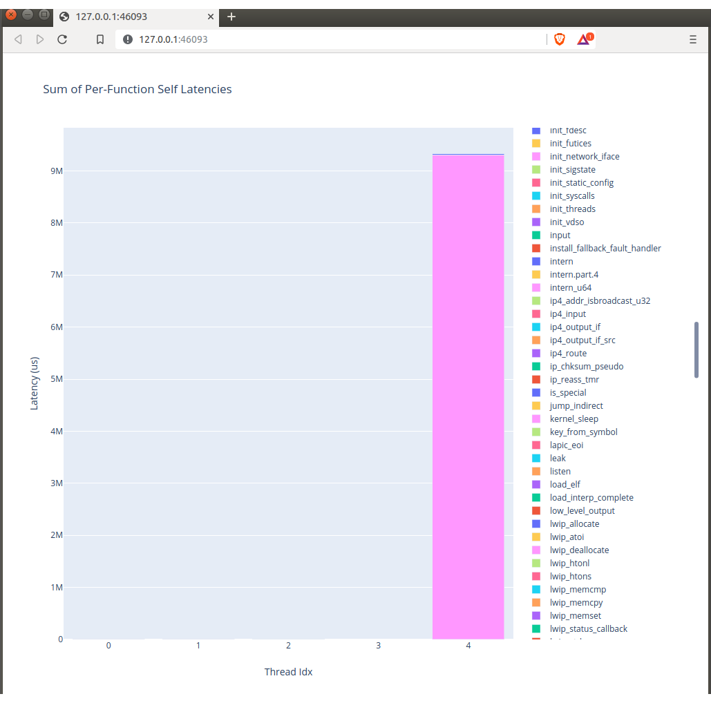
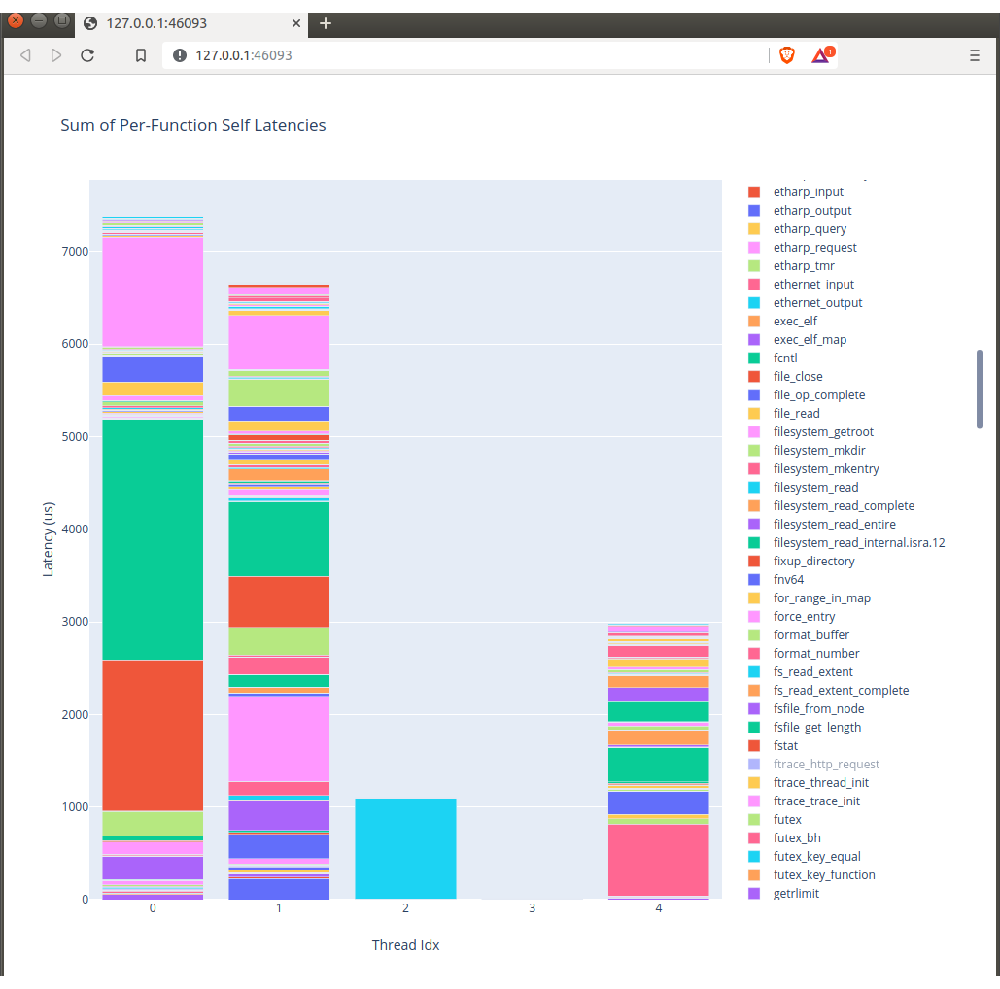

## Overview

Nanos implements a tracing mechanism inspired by [Linux'
ftrace](https://www.kernel.org/doc/Documentation/trace/ftrace.txt). Here we
discuss how to enable tracing in nanos and present some utilities for parsing
the resulting trace data.

## Enabling tracing

To enable tracing, build nanos be specifying `TRACE=ftrace` on the make command; e.g.,

```make clean && make TRACE=ftrace TARGET=<target> run```

The resulting kernel will now collect timing data on the invocation of all
kernel function calls.

## Collecting trace data

Once your application is running, access trace data via http:

```wget localhost:9090/ftrace/trace```

This will create a file called `trace` in your working directory that looks like:

```
# tracer: function_graph
#
# CPU  DURATION                  FUNCTION CALLS
# |     |   |                     |   |   |   |
 0)               |  mcache_alloc() {
 0) ! 207.666 us  |    runtime_memcpy();
 0)   0.071 us    |    runtime_memcpy();
 0)   0.077 us    |    objcache_allocate();
 0) ! 208.173 us  |  }  
 0)   0.093 us    |  install_fallback_fault_handler();
 ...
```

## Trace options

While we do not provide nearly the full set of configuration options as Linux,
we do provide a few:

### Tracer selection

  * #### function_graph
    The function_graph tracer interposes all function entries and return paths, 
    allowing the kernel to collect entry and exit times for all function calls.
    This is the default tracer used by the kernel, and it creates trace files
    with the format shown above.

  * #### function
    The function tracer only interposes function entries. While obviously not
    as useful for measuring function overheads, this mode creates less overhead
    and does still provide a full list of all functions invoked. It can
    currently only be enabled by modifying the `ftrace_enable()` function in
    `src/unix/ftrace.c`, replacing

    ```
    current_tracer = &(tracer_list[FTRACE_FUNCTION_GRAPH_IDX]);
    ```
    with
    ```
    current_tracer = &(tracer_list[FTRACE_FUNCTION_IDX]);
    ```

### Trace data consumption
  Trace data is stored in an in-memory ring buffer, whose size is fixed by default 
  at 64MB. This buffer fills up relatively quickly, and once it is full, subsequent
  function calls will not generate trace data.

  Trace data can either be queried destructively or non-destructively.
  Destructive queries return the data and remove it from the in-kernel ring
  buffer, thus allowing subsequent functions to be traced. These calls are issued via:

  ```
  wget localhost:9090/ftrace/trace_pipe
  ```

  Non-destructive reads return the ring buffer contents without clearing the
  buffer. These are issed via:
  
  ```
  wget localhost:9090/ftrace/trace
  ```

## Trace parsing

We currently provide two scripts that make it easier to parse trace data.
Currently, these scripts only support `function_graph` tracing (the default
tracing mode). They are capable or parsing either `trace` or `trace_pipe`
files.

### [parse-trace.py](parse-trace.py)

Usage:

```
./parse-trace.py <function_graph trace file>
```

This will generate a new file called `trace.csv`

### [runtime-breakdown.py](runtime-breakdown.py)

Usage:

```
./runtime-breakdown.py <trace.csv>
```

(Note that this script requires the pandas and plotly python packages)
This will take a CSV generated by [parse-trace.py](parse-trace.py) and render a
bargraph showing function latencies for all functions in the trace file. One
important note: currently, we report what we call function "self" latencies,
which correspond to the runtime of a function minus the runtimes of all the
functions it invokes. This program calculates, for each function, the sum of
the self latencies over all invocations of the function, and then renders a
graph in your default web browser; e.g.,
  <p align="center">
  
  </p>

By default, __all__ kernel functions will be shown here, including those that
lead to either context switches or mode switches to userspace, and thus have
__very__ long latencies (e.g., `kernel_sleep` as the big purple bar above). Data for such
functions can be disabled by toggling it in the function list on the right, creating
a more readable graph; e.g.,
  <p align="center">
  
  </p>
